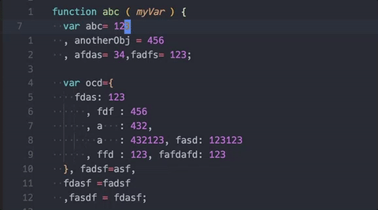
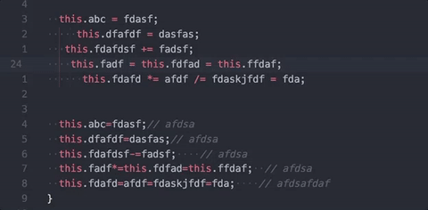
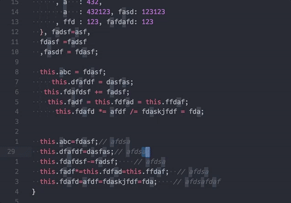
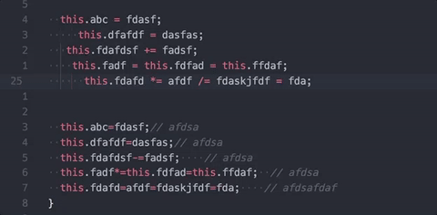

# Better Align

[](https://marketplace.visualstudio.com/items?itemName=wwm.better-align)
[](https://marketplace.visualstudio.com/items?itemName=wwm.better-align)
[](https://marketplace.visualstudio.com/items?itemName=wwm.better-align)

## Features

Align your code by colon(`:`), assignment(`=`,`+=`,`-=`,`*=`,`/=`) and arrow(`=>`).
It has additional support for comma-first coding style and trailing comment.

And it doesn't require you to select what to be aligned, the extension will figure it out by itself.

## How to use

Place your cursor at where you want your code to be aligned, and invoke the Align command via Command Palette or customized shortcut. Then the code will be automatically aligned.

## Screenshots

Comma-first sytle:



Trailing comment:



Align within selection:



## Shortcuts

There's no built-in shortcut comes with the extension, you have to add shotcuts by yourself:
1. Open Command Palette and type `open shortcuts` to open keybinding settings
2. Add something similar like this:
```
{ "key": "ctrl+cmd+=",  "command": "wwm.aligncode",
                           "when": "editorTextFocus && !editorReadonly" }
```

## Extension Settings

### `alignment.operatorPadding` : "left" | "right"

Specify how assignment operator will be aligned.
```
// Original code
this.abc=10;
this.cd+=12;

// left
this.abc =  10;
this.cd  += 12;

// right
this.abc  = 10;
this.cd  += 12;
```

### `alignment.indentBase` : "firstline" | "activeline" | "dontchange"
Specify if it use the indentation of the firstline or the line under the cursor. Below are the `activeline` effect, notice how it's different from the screenshot above.

If `indentBase` is `dontchange`, better-align will only align lines with same indentation and will not modify the indentation.



### `alignment.surroundSpace`
Default value:
```
alignment.surroundSpace : {
  "colon"      : [0, 1], // The first number specify how much space to add to the left, can be negative.
                         // The second number is how much space to the right, can be negative.
  "assignment" : [1, 1], // The same as above.
  "arrow"      : [1, 1], // The same as above.
  "comment"    : 2       // Special how much space to add between the trailing comment and the code.
}
```

```
// Orignal code
var abc = {
  hello:      1
  ,my :2//comment
  ,friend:   3      // comment
}

// "colon": [0, 1]
// "comment": 2
var abc = {
    hello : 1
  , my    : 2  // comment
  , friend: 3  // comment
}

// "colon": [1, 2]
// "comment": 4
var abc = {
    hello  :  1
  , my     :  2    // comment
  , friend :  3    // comment
}

// "colon": [-1, 3]
// "comment": 2
var abc = {
    hello:    1
  , my:       2  // comment
  , friend:   3  // comment
}

// "colon": [-1, -1]
// "comment": 2
var abc = {
     hello:1
  ,     my:2  //comment
  , friend:3  // comment
}


// Orignal code
$data = array(
    'text' => 'something',
    'here is another' => 'sample'
);

// "arrow": [1, 3]
$data = array(
    'text'            =>   'something',
    'here is another' =>   'sample'
);

```
